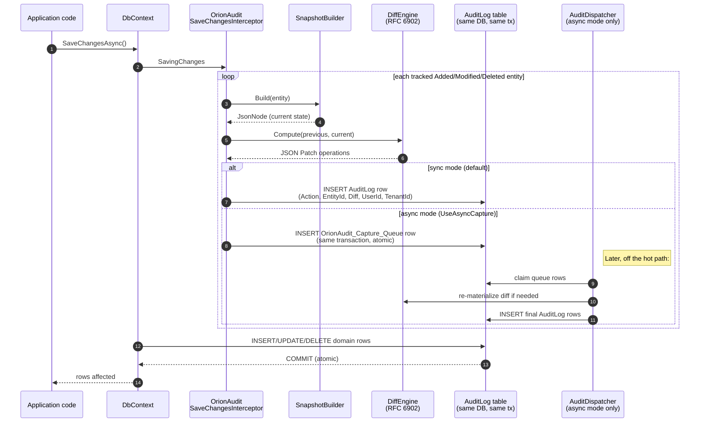

<!-- markdownlint-disable MD033 MD041 MD060 -->

<p align="center">
  
</p>

<h1 align="center">OrionAudit</h1>

<p align="center">
  EF Core change-audit trail with JSON Patch diffs, multi-tenant support, and time-travel reconstruction
</p>

<p align="center">
  <a href="https://www.nuget.org/packages/OrionAudit"></a>
  <a href="https://www.nuget.org/packages/OrionAudit"></a>
  <a href="LICENSE.txt"></a>
  
</p>

---

> **Current release: v0.11.3.** Recent milestones: v0.11.0 richer history filters + aggregations, v0.10.0 background compaction + history export, and v0.9.0 tamper-evident hash-chaining — opt in with `o.UseHashChain(h => h.UseKey(...))` and every captured `AuditLog` row gains a keyed HMAC-SHA256 `EntryHash` that chains it to the row before it (per entity stream, per tenant), so a later edit, deletion (including tail/whole-stream truncation), or reordering of any row is detectable and unforgeable without the MAC key, which lives outside the audit database. `IAuditIntegrityVerifier.VerifyChainAsync` walks the chain and reports the first broken row plus the reason. It is off by default and fully additive. Earlier: v0.8.0 queryable history + compaction, v0.7.0 publisher hook, v0.6.0 developer experience, v0.5.0 async staging-capture + viewer, v0.4.0 AOT-clean diff, v0.3.0 source-gen, v0.2.0 scale, v0.1.0 capture.
> [See the changelog](CHANGELOG.md) and [what's next](ROADMAP.md).

---

## How it works

A SaveChangesInterceptor sits in EF Core's pipeline. For every `[Auditable]` entity in `Added`, `Modified`, or `Deleted` state it builds a snapshot, runs the diff engine against the previous snapshot (loaded from `AuditLog` history or a periodic snapshot), and writes one `AuditLog` row in the same transaction as the data change. Synchronous mode writes the final row directly; async mode writes a lightweight queue row instead and lets a dispatcher hosted service materialize the diff off the hot path.



The diagram makes the two key guarantees visible. In sync mode the `AuditLog` row and the domain rows commit together: either both exist or neither does. In async mode the same atomicity holds for the `Capture_Queue` row, and the dispatcher's "claim, materialize, insert final" trio is itself one transaction so deferred rows are exactly-once.

---

## Why OrionAudit?

| Feature                                | OrionAudit | Audit.NET | EFCore.Triggered | DIY pattern |
| -------------------------------------- | :--------: | :-------: | :--------------: | :---------: |
| EF Core `SaveChanges` interception     |    Yes     |    Yes    |       Yes        |     Yes     |
| JSON Patch (RFC 6902) diffs            |    Yes     |    Yes    |        -         |      -      |
| Time-travel reconstruction             |    Yes     |     -     |        -         |      -      |
| Sensitive-field attributes (Hash/Redact) |  Yes     |     -     |        -         |      -      |
| Multi-tenant read-side filter          |    Yes     |     -     |        -         |      -      |
| Pluggable user / tenant resolvers      |    Yes     |    Yes    |        -         |     Yes     |
| ASP.NET Core HttpContext resolver      |    Yes     |    Yes    |        -         |      -      |
| OpenTelemetry `ActivitySource` + Meter |    Yes     |     -     |        -         |      -      |
| Framework-agnostic test helpers        |    Yes     |     -     |        -         |      -      |
| Multi-targets net8 / net9 / net10      |    Yes     |    Yes    |       Yes        |    n/a      |
| Source-generated type discovery        |    Yes     |     -     |        -         |      -      |
| NativeAOT clean                        |    Yes     |     -     |        -         |      -      |
| Composite primary key support          |    Yes     |    Yes    |       Yes        |     Yes     |
| Periodic snapshotting (O(K) replay)    |    Yes     |     -     |        -         |      -      |
| Retention policy + background sweep    |    Yes     |     -     |        -         |      -      |
| Soft-delete capture (distinct action)  |    Yes     |     -     |        -         |      -      |
| Provider column hints (jsonb / nvarchar(max)) | Yes  |     -     |        -         |      -      |
| Opt-in async staging-capture (atomic, lossless) | Yes |    -     |        -         |      -      |
| Embedded audit-trail UI (no Blazor, no build step) | Yes |   -     |        -         |      -      |
| Storage-agnostic queryable history read API    |    Yes     |     -     |        -         |      -      |
| Snapshot compaction (bounded retained tail)    |    Yes     |     -     |        -         |      -      |

---

## Quick Start (60 seconds)

```bash
dotnet add package OrionAudit
```

```csharp
using Microsoft.EntityFrameworkCore;
using Microsoft.Extensions.DependencyInjection;
using Moongazing.OrionAudit;

// Register configuration and (optional) resolvers
services.AddOrionAudit<AppDbContext>(o => o
    .Audit<Order>()
    .Audit<Customer>(b => b
        .Hash(c => c.Email)        // store SHA-256 hex, not the plaintext
        .Redact(c => c.ApiKey)));  // store the literal "<redacted>"

// Wire the interceptor into your DbContext
services.AddDbContext<AppDbContext>((sp, o) =>
    o.UseSqlServer(connectionString)
     .UseOrionAudit(sp));
```

```csharp
// AppDbContext.cs
protected override void OnModelCreating(ModelBuilder modelBuilder)
{
    modelBuilder.ApplyOrionAuditConfigurations();
}
```

That's it — every `SaveChanges` on an `[Auditable]` entity now writes an `AuditLog` row in the
same transaction.

---

## Ecosystem Packages

| Package                  | Install                                        | Purpose                                            |
| ------------------------ | ---------------------------------------------- | -------------------------------------------------- |
| `OrionAudit`             | `dotnet add package OrionAudit`                | Core library — interceptor, diff, reconstruction   |
| `OrionAudit.AspNetCore`  | `dotnet add package OrionAudit.AspNetCore`     | `HttpContextAuditUserResolver` + DI helpers        |
| `OrionAudit.MySql`       | `dotnet add package OrionAudit.MySql`          | MySQL / MariaDB provider (`ApplyOrionAuditMySqlConfigurations`, JSON/LONGTEXT columns) |
| `OrionAudit.Viewer`      | `dotnet add package OrionAudit.Viewer`         | Embedded read-only audit-trail UI (`MapOrionAuditViewer`) |
| `OrionAudit.Testing`     | `dotnet add package OrionAudit.Testing`        | `AuditCapture` + fluent assertions, framework-free |

---

## What's new in v0.9.0

### Tamper-evident hash-chaining

Opt in with `o.UseHashChain(...)`. Each captured `AuditLog` row then gets a **keyed** HMAC-SHA256
`EntryHash` that binds its content (including any registered custom columns) to the row before it in
the same chain scope (per entity stream, per tenant), plus a `PreviousHash` column and a `HashKeyId`.
A later edit, deletion (including deleting the tail or an entire stream), reordering, or out-of-band
insertion of any row is detected by the verifier.

The chain is a **keyed MAC**, not a bare hash: the key comes from an `IAuditChainKeyProvider` that
lives outside the audit database. That is what makes the chain unforgeable - with a plain SHA-256
chain, anyone who can write rows could recompute the hashes and fake a valid chain. So a key is
required; enabling without one fails fast. Store the secret outside the audit database (a secret
manager / KMS / environment secret).

```csharp
services.AddOrionAudit<AppDbContext>(o =>
{
    o.Audit<Order>();
    // off by default; supply a key (base64, >= 16 bytes) loaded from a secret store.
    o.UseHashChain(h => h.UseKey(keyId: 1, base64Key: Environment.GetEnvironmentVariable("AUDIT_CHAIN_KEY")!));
});
```

A persisted per-stream anchor (`OrionAudit_Chain_Anchor`) makes concurrent same-stream writes safe
(they serialize on the anchor row inside your transaction) and makes tail/whole-stream deletion
detectable (the anchor remembers the true tail hash and row count). The key id is stored per row, so
you can rotate keys later without invalidating rows written under an older (still-registered) key.

`UseHashChain()` adds three nullable columns (`EntryHash`, `PreviousHash`, `HashKeyId`) to the audit
table plus the `OrionAudit_Chain_Anchor` table, so add a migration after enabling it:

```bash
dotnet ef migrations add AddOrionAuditHashChain
```

Verify the chain through the DI-registered `IAuditIntegrityVerifier`:

```csharp
using Moongazing.OrionAudit.Integrity;

var verifier = serviceProvider.GetRequiredService<IAuditIntegrityVerifier>();

// One entity's trail...
var result = await verifier.VerifyChainAsync(
    AuditChainVerificationRequest.ForEntity(typeof(Order).AssemblyQualifiedName!, order.Id.ToString()));

// ...or the whole table.
var all = await verifier.VerifyChainAsync(AuditChainVerificationRequest.All());

if (!all.IsValid)
{
    // all.BrokenAtId / all.BrokenEntityType / all.BrokenEntityId / all.Reason pinpoint the first break.
    Console.WriteLine($"Audit chain broken at {all.BrokenAtId}: {all.Reason} ({all.Detail})");
}
```

The chain is **opt-in and backward compatible**: rows written before you enabled it keep a null
hash and verify as an unchained prefix the verifier skips, so verification begins at each stream's
first hashed (genesis) row. Capture, diffs, snapshot compaction, and the read APIs are unchanged
whether or not chaining is on. Canonicalization is deterministic and stable across a database
round-trip (fixed field order, length-prefixed fields, invariant culture, UTF-8, and a
precision-stable timestamp), so a legitimately persisted row always re-verifies.

## What's new in v0.8.0

### `IAuditHistoryStore` — storage-agnostic queryable history read API

`IAuditHistoryStore` is a read and maintenance surface over recorded `AuditLog` rows that does
not bind to where those rows live. The default `EfCoreAuditHistoryStore` is registered by
`AddOrionAudit` against your `DbContext`, so it resolves from DI with no extra wiring:

```csharp
using Moongazing.OrionAudit.Store;

var store = serviceProvider.GetRequiredService<IAuditHistoryStore>();

// Every write to a single Order by one user, oldest first, second page of 50.
var page = await store.QueryAsync(new AuditHistoryQuery
{
    EntityType = typeof(Order).AssemblyQualifiedName,
    EntityId = order.Id.ToString(),
    UserId = "u-123",
    Action = AuditAction.Updated,
    FromUtc = DateTime.UtcNow.AddDays(-30),
    ToUtc = DateTime.UtcNow,
    Order = AuditHistoryOrder.OldestFirst,
    Skip = 50,
    Take = 50,
});

foreach (var row in page.Items)
{
    Console.WriteLine($"{row.OccurredOnUtc:o}  {row.Action}  {row.UserId}");
}

// page.TotalCount is the match count before paging; page.HasMore drives "load more".
Console.WriteLine($"showing {page.Items.Count} of {page.TotalCount}, more={page.HasMore}");
```

Every filter on `AuditHistoryQuery` is optional. A default-constructed query returns the whole
history, newest first, capped by `AuditHistoryQuery.DefaultPageSize` (100), so an unfiltered
query never materialises an unbounded result. `FromUtc` and `ToUtc` are inclusive bounds and
must be UTC instants (`DateTimeKind.Utc`). `Validate()` rejects a negative `Skip`, a `Take`
below 1, a non-UTC bound, or an inverted time range, and each store calls it before executing
so every backend reports the same diagnostics.

`AuditHistoryStoreBase` supplies a capability default that throws `NotSupportedException` for
each operation, so a backend that cannot page or cannot compact overrides only what it can
honour. This mirrors the family's `DeleteAuditArchiver`-as-default pattern. `OrionAudit.Testing`
ships an `InMemoryAuditHistoryStore` that implements the full surface over an in-memory row list
for tests and prototyping against the abstraction.

### Snapshot compaction — fold old history into a base snapshot

Compaction collapses a long Insert-then-many-Updates history for one entity into a single
compacted snapshot row, plus a bounded retained tail of the most-recent rows kept verbatim. The
folded rows are removed, which bounds storage growth while keeping the latest state fully
reconstructable.

```csharp
var result = await store.CompactAsync(new AuditCompactionRequest
{
    EntityType = typeof(Order).AssemblyQualifiedName!,
    EntityId = order.Id.ToString(),
    RetainTail = 20,   // keep the 20 most-recent rows verbatim after the snapshot
    TenantId = "tenant-acme",   // optional: scope to one tenant's rows for a shared id
});

Console.WriteLine($"folded {result.RowsRemoved} rows: {result.RowsBefore} -> {result.RowsAfter}");
```

`RetainTail` is the number of most-recent rows kept after the snapshot; zero collapses the
entire history into one snapshot row. When the history is too short to gain anything the call is
a no-op (`SnapshotWritten` is false). A folded `Deleted` or `SoftDeleted` boundary stays a
terminal state. The `EfCoreAuditHistoryStore` applies the plan as one insert plus delete inside
a single `SaveChanges` transaction, so a failure leaves the history untouched. The folding engine
replays the history over `AuditLog` JSON via the in-house `DiffEngine`, so it carries no
reflection and stays trim-safe and Native-AOT clean.

---

## What's new in v0.6.0

### `AddColumn` — tipped, indexable custom columns

```csharp
services.AddOrionAudit<AppDbContext>(o => o
    .Audit<Order>()
    .AddColumn<int>("WorkflowStepId", ctx => (ctx.Entity as IHasWorkflow)?.StepId)
    .AddColumn<string>("Source", ctx => ctx.Action == AuditAction.Inserted ? "import" : "app"));

// OnModelCreating: pick up registered columns automatically.
protected override void OnModelCreating(ModelBuilder modelBuilder)
    => modelBuilder.ApplyOrionAuditConfigurations(this);

// LINQ filter on a real, indexable column:
var fromStep3 = await db.AuditLog()
    .Where(a => EF.Property<int?>(a, "WorkflowStepId") == 3)
    .ToListAsync();
```

Add a `CreateIndex` in your EF migration for any column you'll filter on. The provider runs
inside the capture transaction with the audited entity in scope; failure annotates
`AuditLog.Error` and leaves the column NULL. In async-capture mode the value rides through
the queue's new `CustomColumnsJson` column and lands on the final `AuditLog` after dispatch.

### `AuditImportBuilder` — bulk historical import, idempotent

```csharp
var import = db.CreateAuditImport(o =>
{
    o.BatchSize = 1000;
    o.ImportBatch = "legacy-orders-2026";   // REQUIRED — drives idempotency
});

import.Add<Order>(e => e
    .Key(legacy.OrderId)
    .Action(AuditAction.Updated)
    .Before(oldState).After(newState)
    .By("u-123", "Legacy User")
    .At(legacy.ChangedAtUtc)
    .SourceId(legacy.RowId));

var result = await import.SaveAsync();
// result.Written / Skipped / DeadLettered
```

`ImportBatch` is mandatory — it stamps `AuditLog.CorrelationId` so re-running `SaveAsync` is
safe (rows already present report as `Skipped`). Imported diffs are byte-for-byte equal to the
diffs the live capture path produces (a parity test enforces this). Import always writes
`AuditLog` directly, bypassing the async-capture queue.

---

## What's new in v0.5.0

### Async staging-capture — atomic, lossless, off the hot path

Synchronous capture (the default since v0.1.0) writes the `AuditLog` row in the same
transaction as the originating change. Under high write load the diff computation and the
extra row become measurable overhead. Opt-in `UseAsyncCapture()` keeps the atomicity guarantee
but defers the heavy work:

```csharp
services.AddOrionAudit<AppDbContext>(o => o
    .Audit<Order>()
    .UseAsyncCapture(q => q
        .PollInterval(TimeSpan.FromSeconds(2))
        .BatchSize(500)
        .MaxAttempts(5)));
```

- The interceptor writes a lightweight `OrionAudit_Capture_Queue` row **in the same
  transaction** as the data change — capture stays atomic and lossless.
- `AuditDispatcherHostedService` polls the queue, computes diffs, and writes the final
  `AuditLog` rows. Inserts and deletes commit together → exactly-once.
- A row that throws is retried up to `MaxAttempts` and then dead-lettered (`Error` column
  set; surfaced via `orionaudit.dispatch.rows_deadlettered` telemetry).
- `IAuditDispatcher.FlushPendingAsync(ct)` force-drains the queue for tests and
  read-after-write call sites. A no-op implementation is registered in synchronous mode so
  the dependency is always resolvable.

**Trade-off to know:** in async mode `AuditFor<T>()` sees only dispatched rows, so audit is
eventually consistent. Use `FlushPendingAsync` where you need read-after-write.

### `OrionAudit.Viewer` — read-only audit UI, one line to embed

```csharp
app.MapOrionAuditViewer<AppDbContext>("/audit", o => o.RequireAuthorization("AuditViewers"));
```

That single registration mounts a JSON API (`GET /audit/api/log`, `/audit/api/{type}/{key}`,
`/audit/api/meta`) plus a built-in vanilla-JS single-page UI served from `/audit`. No Blazor
dependency, no build step — drops into any ASP.NET Core host. Authorization is required by
default; an explicit `AllowAnonymous()` opts out (dev use only).

Tenant filtering is honoured automatically: the API reads through `db.AuditLog()`, which
applies the registered `IAuditTenantResolver`.

### Benchmark — the honest story

`InterceptorBench` (in-memory SQLite, .NET 10 — `bench/Moongazing.OrionAudit.Bench`):

| Scenario                | Batch | Mean (µs) | Ratio | Allocated         |
| ----------------------- | ----- | --------: | :---: | ----------------- |
| `SaveChanges_NoAudit`        | 1     |     277 | 1.00× | 71 KB             |
| `SaveChanges_WithAudit`      | 1     |     769 | 2.82× | 96 KB (1.35×)     |
| `SaveChanges_WithAsyncAudit` | 1     |   1 311 | 4.80× | 95 KB (1.34×)     |
| `SaveChanges_NoAudit`        | 10    |     957 | 1.00× | 141 KB            |
| `SaveChanges_WithAudit`      | 10    |   3 936 | 4.18× | 335 KB (2.37×)    |
| `SaveChanges_WithAsyncAudit` | 10    |   3 414 | 3.62× | 343 KB (2.43×)    |
| `SaveChanges_NoAudit`        | 100   |   6 023 | 1.00× | 819 KB            |
| `SaveChanges_WithAudit`      | 100   |  13 720 | 2.36× | 2.7 MB (3.31×)    |
| `SaveChanges_WithAsyncAudit` | 100   |  14 259 | 2.45× | 2.8 MB (3.45×)    |

In-memory SQLite is unkind to async-mode bookkeeping — the `ExecuteUpdateAsync` claim plus
the queue insert show up as raw cost without the network round-trip latency a real DB has.
On a production SQL Server or Postgres, two things change in async mode's favour: the
baseline `SaveChanges` carries network IO that absorbs sync mode's diff CPU into a much
larger denominator, and the deferred `SnapshotCursor` lookup (a per-update DB query inside
the consumer's transaction) genuinely leaves the hot path. Treat async capture as a
correctness-preserving way to move materialisation off the consumer's transaction; it's a
*throughput* feature, not a microbenchmark win.

The capture-queue depth is exposed as `orionaudit.capture.queue_depth` (observable gauge) so
operators can watch dispatch lag in their dashboards.

---

## Core Features

### Auto-capture on every SaveChanges

`AuditSaveChangesInterceptor` registers itself in EF Core's interceptor pipeline. For every
`[Auditable]` entity in `EntityState.Added | Modified | Deleted`, it writes one `AuditLog` row
inside the same transaction as the originating change.

```csharp
ctx.Orders.Add(new Order { Status = "Pending" });
await ctx.SaveChangesAsync();
// → AuditLog row: Action=Inserted, EntityId=..., Diff=[{"op":"add","path":"/Status","value":"Pending"}]
```

### JSON Patch (RFC 6902) diffs

Diffs are computed by OrionAudit's in-house, reflection-free RFC 6902 engine and stored in the
`Diff` column as compact JSON. They are replayable — that's what makes time-travel
reconstruction possible.

```csharp
order.Status = "Shipped";
await ctx.SaveChangesAsync();
// → Diff = [{"op":"replace","path":"/Status","value":"Shipped"}]
```

### Sensitive-field handling

Attributes and equivalent fluent overrides — both control what lands in the audit table without
touching the entity class beyond the attribute.

```csharp
[Auditable]
public sealed class Customer
{
    public Guid Id { get; set; }
    public string Name { get; set; } = "";

    [HashedAudit]   public string Email { get; set; } = "";   // SHA-256 hex
    [RedactedAudit] public string ApiKey { get; set; } = "";  // literal "<redacted>"
    [NotAuditable]  public string Internal { get; set; } = ""; // omitted entirely
}

// Equivalent fluent form:
services.AddOrionAudit<AppDbContext>(o => o
    .Audit<Customer>(b => b
        .Hash(c => c.Email)
        .Redact(c => c.ApiKey)
        .Exclude(c => c.Internal)));
```

`Hash` is deterministic, so equality checks on the audit table still work without leaking
plaintext. `Redact` replaces the value with the literal `"<redacted>"` — change detection breaks
on purpose for fields where even the existence of a change is sensitive.

### Multi-tenant capture and read-side filter

Implement `IAuditTenantResolver` once; every audit row gets the tenant id stamped, and every
`AuditFor<T>()` query auto-filters to the current tenant.

```csharp
public sealed class CurrentTenantResolver : IAuditTenantResolver
{
    private readonly ITenantContext context;
    public CurrentTenantResolver(ITenantContext context) => this.context = context;
    public string? Resolve(IServiceProvider sp) => context.TenantId;
}

services.AddOrionAudit<AppDbContext>(o => o
    .Audit<Order>()
    .TenantResolver<CurrentTenantResolver>());

// Reads automatically scoped to current tenant
var rows = await context.AuditFor<Order>().ToListAsync();

// Need the global view for admin tooling?
var allRows = await context.AuditFor<Order>(crossTenant: true).ToListAsync();
```

### Time-travel reconstruction

`IAuditReconstructor` replays the audit history of an entity up to any timestamp.

```csharp
var reconstructor = serviceProvider.GetRequiredService<IAuditReconstructor>();

// Single entity
var orderAsOfYesterday = await reconstructor.ReconstructAsync<Order>(
    entityId: order.Id.ToString(),
    asOf: DateTime.UtcNow.AddDays(-1));

// Batch — one query, then per-entity replay
var manyAsOf = await reconstructor.ReconstructManyAsync<Order>(
    entityIds: orderIds.Select(id => id.ToString()),
    asOf: DateTime.UtcNow.AddHours(-3));
```

Returns `null` if the entity didn't exist or was deleted at that timestamp.

### User attribution via ASP.NET Core

```bash
dotnet add package OrionAudit.AspNetCore
```

```csharp
builder.Services
    .AddOrionAudit<AppDbContext>(o => o
        .Audit<Order>()
        .UserResolver<HttpContextAuditUserResolver>())
    .AddOrionAuditAspNetCore();
```

`HttpContextAuditUserResolver` pulls the user from `HttpContext.User` via the
`NameIdentifier` / `sub` claim and populates `AuditLog.UserId` / `UserDisplay`. Anonymous
requests leave those columns null without breaking the capture.

### OpenTelemetry instrumentation

Spans and metrics are emitted under the `OrionAudit` `ActivitySource` and `Meter`.

```csharp
builder.Services
    .AddOpenTelemetry()
    .WithTracing(t => t.AddSource(OrionAuditTelemetry.ActivitySourceName))
    .WithMetrics(m => m.AddMeter(OrionAuditTelemetry.MeterName));
```

| Signal                              | Type      | Description                                       |
| ----------------------------------- | --------- | ------------------------------------------------- |
| `OrionAudit.Capture`                | Activity  | One span per `SaveChanges` that wrote audit rows  |
| `OrionAudit.Reconstruct`            | Activity  | One span per `ReconstructAsync` call              |
| `OrionAudit.ReconstructMany`        | Activity  | One span per `ReconstructManyAsync` call          |
| `orionaudit.entries.written`        | Counter   | Audit rows successfully written                   |
| `orionaudit.entries.failed`         | Counter   | Audit rows written with diff errors               |
| `orionaudit.capture.duration`       | Histogram | Interceptor capture duration in milliseconds      |
| `orionaudit.reconstruct.duration`   | Histogram | Reconstruction duration in milliseconds           |

### Source-generated registration (AOT-aware)

Skip the runtime assembly scan entirely. Decorate a `partial class` with `[OrionAuditModule]`
and the bundled source generator emits a `RegisterAuditedTypes` method that registers every
`[Auditable]` type discovered at compile time.

```csharp
[OrionAuditModule]
public partial class AppAuditModule { }

// A hand-written System.Text.Json context covering your audited entities
[JsonSerializable(typeof(Order))]
[JsonSerializable(typeof(Customer))]
public partial class AppJsonContext : JsonSerializerContext { }

services.AddOrionAudit<AppDbContext>(o =>
{
    AppAuditModule.RegisterAuditedTypes(o.ConfigurationBuilder);  // generator-emitted, no reflection
    o.UseJsonContext(AppJsonContext.Default);                     // trim-aware snapshot serialisation
});
```

The generator ships *inside* the `OrionAudit` NuGet (`analyzers/dotnet/cs/`) — no extra
package to install. The reflective `ScanAssembly` path still works and now carries
`[RequiresUnreferencedCode]` so trim/AOT publishes flag it. As of v0.4.0 the diff engine is
in-house and fully reflection-free. The snapshot-capture path is Native-AOT clean when wired
through `UseJsonContext`; without a context it falls back to reflective serialization, which
is annotated with `[RequiresUnreferencedCode]` / `[RequiresDynamicCode]` so trim/AOT publishes
flag it. A CI Native-AOT probe publishes the context-wired surface and fails the build on any
trim/AOT warning.

### Framework-agnostic test helpers

```bash
dotnet add package OrionAudit.Testing
```

```csharp
using Moongazing.OrionAudit.Testing;

ctx.Orders.Add(new Order { Status = "Pending" });
await ctx.SaveChangesAsync();

AuditCapture.From(ctx)
    .Should()
    .HaveLogged<Order>(AuditAction.Inserted)
    .HaveLoggedExactly(1).Of<Order>();
```

`OrionAudit.Testing` throws plain exceptions on failure, so it works with xUnit, NUnit, MSTest,
or any other runner — no transitive `FluentAssertions` / `Shouldly` choice forced on you.
`InMemoryAuditUserResolver` and `InMemoryAuditTenantResolver` round out the test-doubles surface.

---

## Benchmarks

See [benchmarks.md](benchmarks.md) for the full BenchmarkDotNet run, environment, and per-scenario interpretation (snapshot build, JSON Patch compute vs. apply, EF Core SaveChanges overhead, time-travel reconstruction). Headline numbers from the last measured run on an Intel i7-7820HQ (Kaby Lake), .NET 10.0.5, BenchmarkDotNet 0.15.8:

- Snapshot build of a 7-property entity: ~677 ns, ~984 B allocated.
- JSON Patch compute on 16 properties: ~96 us, ~88 KB.
- JSON Patch apply on the same diff: ~36 us, ~15 KB (about 5x cheaper than compute).
- SaveChanges overhead on in-memory Sqlite: 3.5x for single-row, 4.2x for 100-row batches; drops into the 5-15 percent range on a real DB where round-trip dominates.
- Reconstruction at depth 1000: ~9 ms, ~4.3 MB (O(N) without snapshotting).

Reproduce with `dotnet run -c Release --project bench/Moongazing.OrionAudit.Bench`.

---

## Sample Application

```bash
dotnet run --project sample/Moongazing.OrionAudit.Sample.Console
```

The sample walks through the features end-to-end against an in-memory Sqlite DB: insert / update
/ delete cycles, sensitive-field masking, multi-tenant filtering, time-travel reconstruction,
live OpenTelemetry activity capture, periodic snapshotting, soft-delete capture, and the v0.8.0
queryable history read API plus snapshot compaction. Each section prints what just happened so
you can scan the output instead of reading source.

---

## Documentation

- [Roadmap](ROADMAP.md) — forward plan through v1.0.0 (Q2 2027). Shipped since v0.9.0: v0.10.0 background compaction + history export, v0.11.0 richer history filters + aggregations. Still ahead: a separate audit store, AOT polish, and the API freeze.
- [Contributing guide](CONTRIBUTING.md)
- [Design spec](docs/superpowers/specs/2026-05-13-orionaudit-v0.1.0-design.md)
- [v0.1.0 implementation plan](docs/superpowers/plans/2026-05-13-orionaudit-v0.1.0.md)
- Sample console: [`sample/Moongazing.OrionAudit.Sample.Console`](sample/Moongazing.OrionAudit.Sample.Console)
- Benchmarks: [`bench/Moongazing.OrionAudit.Bench`](bench/Moongazing.OrionAudit.Bench)

---

## More from the Orion family

OrionAudit is one of a set of standalone .NET libraries:

- [OrionGuard](https://github.com/tunahanaliozturk/OrionGuard) - guard clauses, validation, DDD primitives.
- [OrionKey](https://github.com/tunahanaliozturk/OrionKey) - source-generated strongly-typed IDs.
- [OrionLock](https://github.com/tunahanaliozturk/OrionLock) - distributed locking.
- [OrionPatch](https://github.com/tunahanaliozturk/OrionPatch) - transactional outbox for EF Core (enqueue inside SaveChanges, dispatch at-least-once through a pluggable sink).

---

### See it in a real app

[Moongazing.OrionShowcase](https://github.com/tunahanaliozturk/OrionShowcase) is a production-shaped banking sample integrating all six Orion packages end-to-end. OrionAudit captures Account/Customer/Transaction entity diffs automatically via SaveChangesInterceptor. Concrete usage in the showcase:

- [src/Moongazing.OrionShowcase.Infrastructure/DependencyInjection/InfrastructureServiceCollectionExtensions.cs](https://github.com/tunahanaliozturk/OrionShowcase/blob/main/src/Moongazing.OrionShowcase.Infrastructure/DependencyInjection/InfrastructureServiceCollectionExtensions.cs)
- [src/Moongazing.OrionShowcase.Infrastructure/Persistence/BankingDbContext.cs](https://github.com/tunahanaliozturk/OrionShowcase/blob/main/src/Moongazing.OrionShowcase.Infrastructure/Persistence/BankingDbContext.cs)

---

## Contributing

Issues and pull requests welcome. Please read [CONTRIBUTING.md](CONTRIBUTING.md) and the [Code of Conduct](CODE_OF_CONDUCT.md) before opening one.

## License

This project is licensed under the [MIT License](LICENSE.txt).

## Author

**Tunahan Ali Ozturk** — [GitHub](https://github.com/tunahanaliozturk) — published on NuGet as **Moongazing**.
